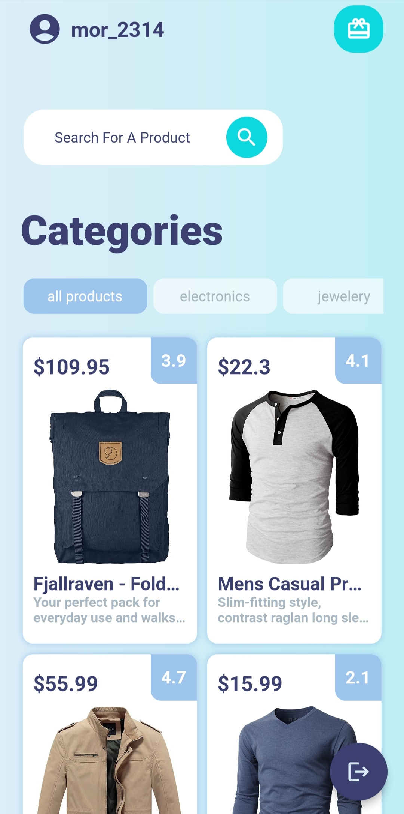
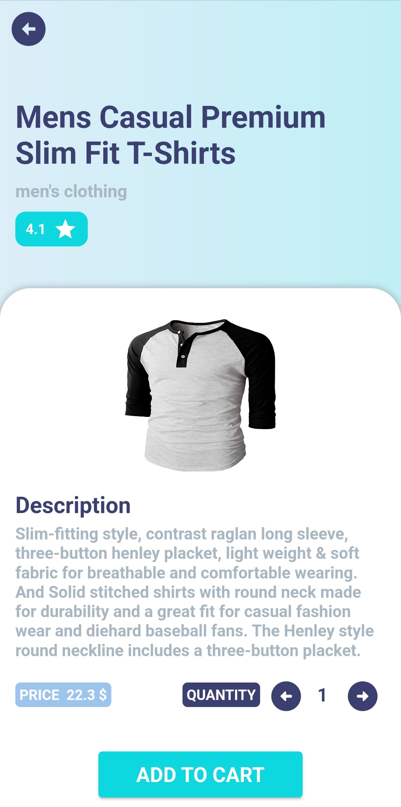
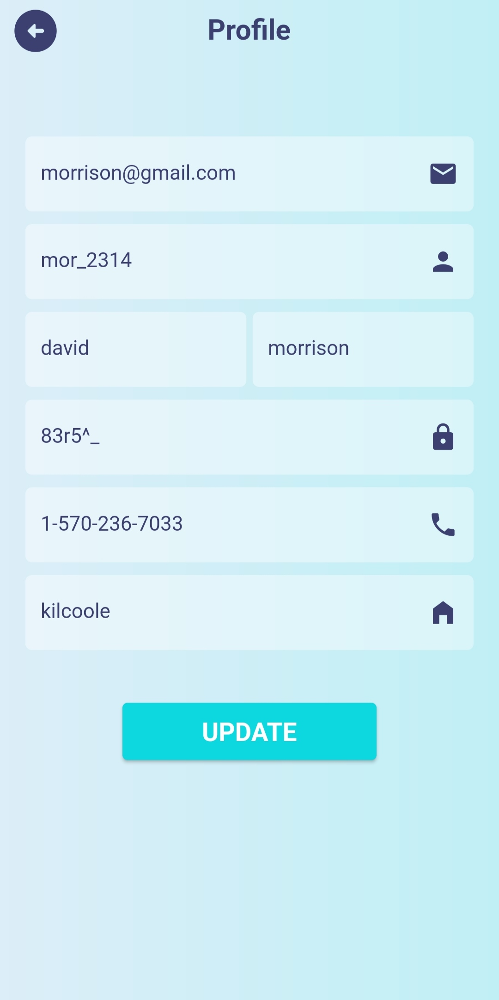
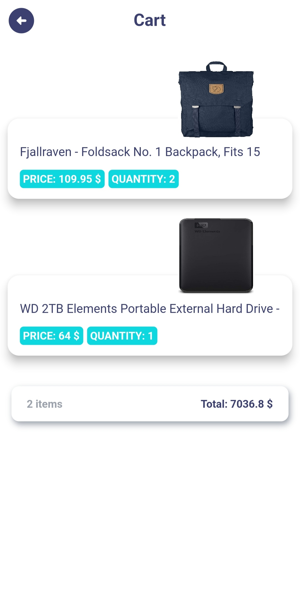
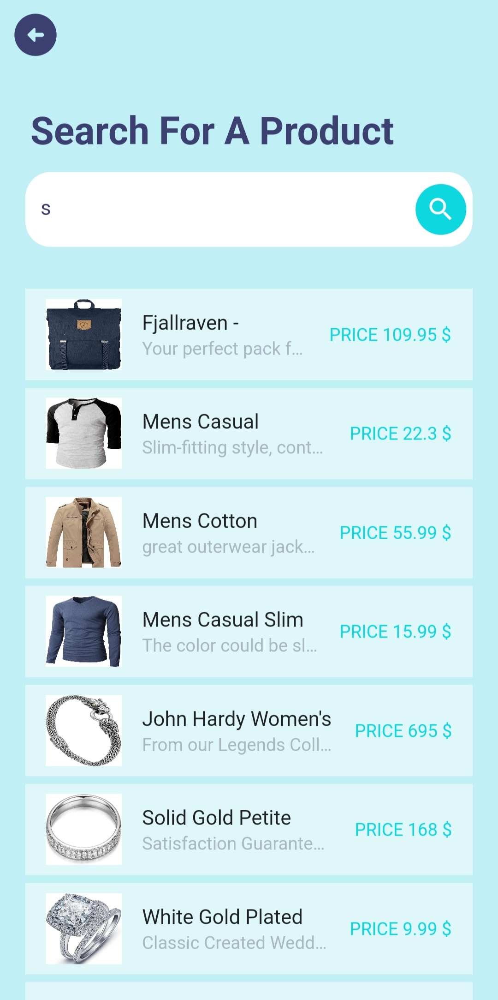
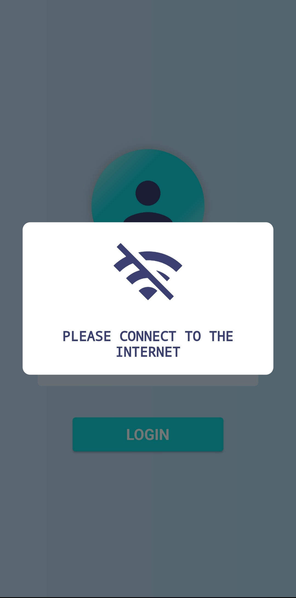

# store_app 🏪💰

Flutter project 🐦📱

## The Packages Was Used 📦🧰

1) http  
2) cached_network_image  
3) shared_preferences  
4) connectivity_plus  
5) modal_progress_hud_nsn  
6) provider  
7) get  

## The Final Result 🤯😎🔥  

  

  

  

  

  

  

  

  
